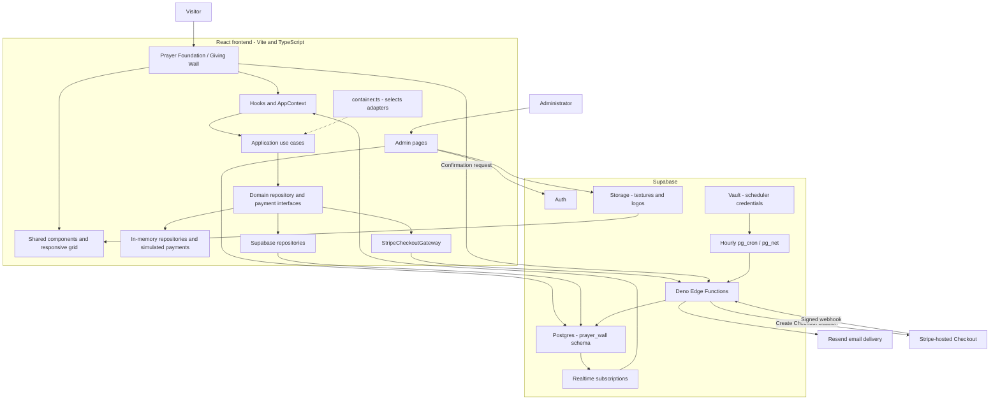
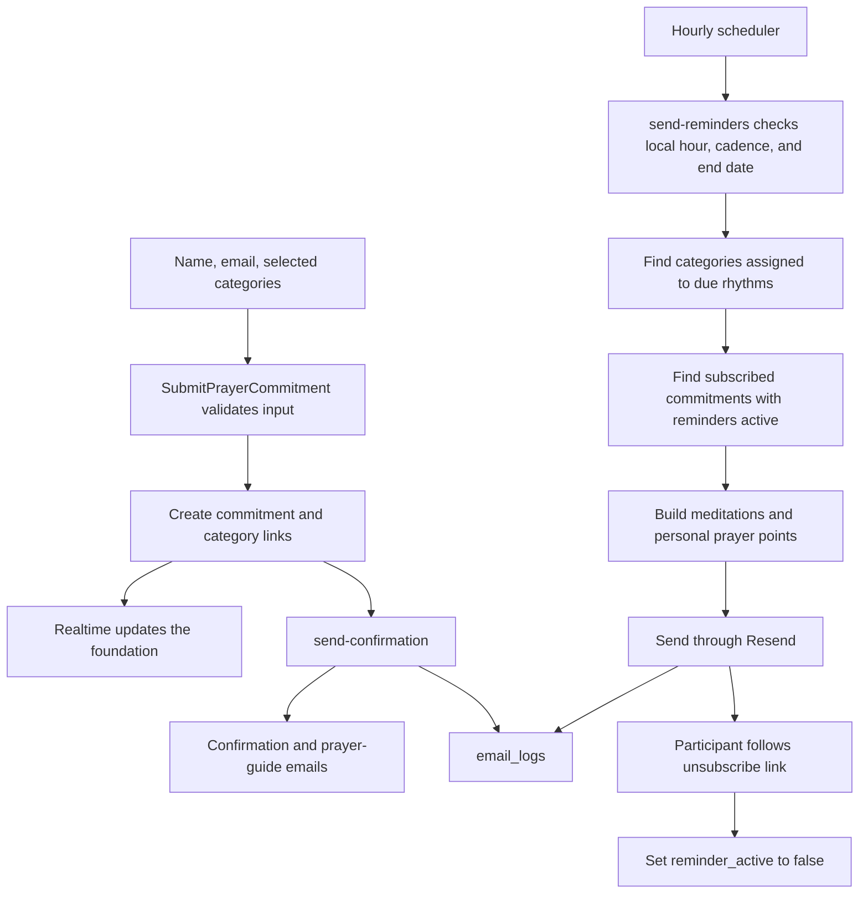
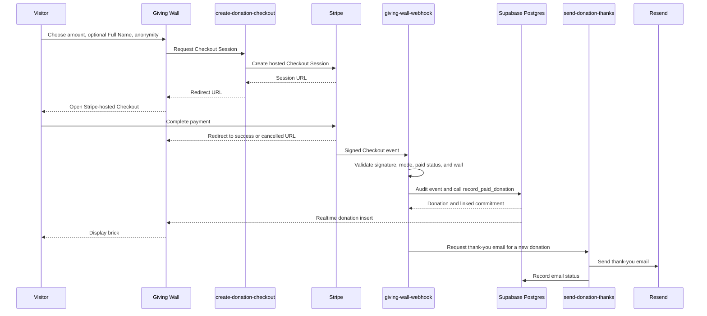

# Prayer Foundation & Giving Wall

A React and TypeScript application that helps an organization build a visible community of prayer supporters and donors. The **Prayer Foundation** displays a stone for each prayer commitment; the **Giving Wall** displays a brick for each recorded gift. Both products share presentation components, theme controls, and infrastructure.

The frontend is built with Vite and Tailwind CSS. Supabase provides the database, authentication, Storage, Realtime, and Deno Edge Functions. Stripe handles hosted payment checkout, and Resend delivers email. Public views can also run with in-memory mock repositories for local development.

## Contents

- [Products and features](#products-and-features)
- [Architecture](#architecture)
- [User journeys](#user-journeys)
- [Routes](#routes)
- [Local development](#local-development)
- [Configuration](#configuration)
- [Database and migrations](#database-and-migrations)
- [Edge Functions and email](#edge-functions-and-email)
- [Deployment](#deployment)
- [Verification and troubleshooting](#verification-and-troubleshooting)
- [Repository guide](#repository-guide)

## Products and features

### Prayer Foundation

Visitors select one or more prayer categories, enter their name and email, and add a stone to the foundation. Names appear publicly; email addresses are not displayed on the wall. New commitments arrive through Supabase Realtime.

After signup, the app requests a confirmation email and a prayer guide containing category meditations. Scheduled reminders use active categories and rhythms, with personal prayer points included where available. Participants can unsubscribe from reminders through an email link.

The prayer admin area includes:

- **Categories:** create, rename, reorder, activate, and manage categories, their meditations, and rhythm assignments.
- **Rhythms:** configure daily, weekly, or monthly schedules, local send times, timezones, activation, and end dates.
- **Stonemasons:** manage prayer participants, prayer points, and individual rhythm assignments.
- **Assets:** upload wall textures and logos.
- **Theme:** edit colors, fonts, layout settings, and interface copy with live preview.

The current reminder worker selects recipients through **category-to-rhythm assignments**. Individual rhythm assignments exist in the admin and database, but the worker does not currently use `commitment_rhythms` to select recipients.

### Giving Wall

Visitors choose a preset or custom gift amount, optionally provide a Full Name, and can choose to appear as Anonymous. In Supabase mode, the app redirects them to **Stripe-hosted Checkout** to enter payment details.

A verified, paid Checkout event records the donation and a linked commitment. Realtime then updates the giving wall, and the webhook requests a thank-you email. A successful donation does **not** subscribe the donor to prayer reminders.

The giving admin area includes Rhythms, Assets, Theme, and **Bricklayers**. The Bricklayers view lists recorded donations, amounts, dates, processor references, email opt-out status, and a total. A Rhythms tab is available, but the current email worker is a category-based prayer reminder worker; a separate recurring donor-email campaign is not implemented.

### Shared presentation

Both public walls use `WallHeader`, `WallBanner`, `WallGrid`, `WallBrick`, and the shared modal and form controls. `useWallLayout` measures the grid container with `ResizeObserver`, adapts the number and size of tiles, and observes live theme changes. The configured row count acts as a maximum; narrower containers use fewer columns. Alternate rows retain their stagger except in a single-column layout.

Public headers and forms adapt to narrow screens. Dialog content scrolls within the available viewport height while keeping the close button visible. Themes and cached assets are separated by wall, with Storage folders such as `prayer/stone`, `prayer/logo`, `giving/stone`, and `giving/logo`.

## Architecture



The public business flows follow a layered architecture:

| Layer | Location | Responsibility |
| --- | --- | --- |
| Domain | `src/domain/` | Entities, repository/payment interfaces, and domain errors. |
| Application | `src/application/` | Use cases and input DTOs for commitments, categories, meditations, checkout, and opt-out. |
| Infrastructure | `src/infrastructure/` | Supabase and mock adapters, payment gateways, theme handling, database types, and dependency wiring. |
| Presentation | `src/presentation/` | React pages, components, hooks, and context. |
| Server functions | `supabase/functions/` | Privileged payment persistence, email delivery, and opt-out endpoints. |

[`container.ts`](src/infrastructure/container.ts) chooses mock or Supabase adapters and constructs the use cases exposed through `useContainer()`. Admin pages also use the Supabase client directly for management operations. The frontend is a single-page application; there is no separate Express or Python application server.

## User journeys

### Prayer signup and reminders



Prayer signup writes the commitment and category links in separate database requests. Email delivery is requested after the signup succeeds; the displayed success message is not proof of successful email delivery. Check `email_logs` and Edge Function logs when diagnosing email issues.

### Donation checkout



Stripe's redirect and webhook are independent; the brick can appear after the visitor returns. The redirect does not create a donation. The webhook handles `checkout.session.completed` and `checkout.session.async_payment_succeeded`, and only records paid sessions. Event auditing and an idempotent database function protect against duplicate payment records on retries.

Only the webhook's service-role path may create production donations. The `record_paid_donation` function creates the donation and linked commitment in one transaction. The commitment has `reminder_active = false`. Explicit anonymity takes precedence over the optional Full Name and Stripe billing-name fallback.

## Routes

| Path | Purpose |
| --- | --- |
| `/`, `/prayer` | Public Prayer Foundation. |
| `/commit` | Alternate prayer commitment entry page. |
| `/giving` | Public Giving Wall and checkout entry. |
| `/giving?checkout=success` | Checkout return message; the donation arrives separately through the webhook. |
| `/giving?checkout=cancelled` | Cancelled checkout return message. |
| `/admin`, `/prayer/admin` | Prayer administration. |
| `/giving/admin` | Giving administration. |
| `/unsubscribe?id=<commitment-id>` | Stop prayer reminders. |
| `/unsubscribe?donation=<donation-id>` | Opt out of donation emails. |

Admin login uses Supabase email/password authentication and checks the configured `VITE_ADMIN_EMAIL`. That frontend check is not a substitute for database grants and row-level security (RLS).

## Local development

### Prerequisites

- Node.js **22 or newer** and npm, including for the Node-based Edge Function regression tests.
- A Supabase project for persisted data and admin functionality.
- Access to the Supabase CLI for function deployment; it is not needed for the mock public views.

### Start with mock public views

```bash
npm ci
```

Copy [`.env.example`](.env.example) to `.env.local`. For example, in PowerShell:

```powershell
Copy-Item .env.example .env.local
```

Set `VITE_USE_MOCK=true`. Keep the example organization and prayer wall IDs to use the seeded mock data. **Remove or leave blank `VITE_SUPABASE_URL` and `VITE_SUPABASE_ANON_KEY` for an entirely offline public-view demo.** The shared client is still created when both variables are supplied, and the prayer form can attempt a confirmation-function call through that client even in mock mode.

```bash
npm run dev
```

Open the address printed by Vite, usually `http://localhost:5173`, and visit `/` and `/giving`. Mock data is in memory and resets on reload. Mock Realtime simulates new entries. The giving wall uses a simulated payment form: `4242 4242 4242 4242` approves and `4000 0000 0000 0002` declines; no payment processor is called.

**Mock mode covers the public use cases, not the admin screens.** Admin pages require a configured Supabase client and an authorized account. In PowerShell environments that block `npm.ps1`, use `npm.cmd` for the same commands.

### Run with Supabase

1. Prepare the schema and wall records using the migration guidance below.
2. Set `VITE_USE_MOCK=false` and replace the example project URL, anon key, organization ID, and wall IDs with actual values.
3. Configure an admin account, Storage bucket, and Realtime for `commitments` and `donations` as needed.
4. Deploy the required Edge Functions and configure their secrets.
5. Restart Vite after changing `.env.local`.

Supabase mode requires the configured wall IDs to exist in the database. The placeholder UUIDs in `.env.example` are not production records.

## Configuration

### Frontend environment

Vite embeds `VITE_*` values into the browser bundle at build time. Set them before building and rebuild when deployment values change. Keep server credentials out of these variables.

| Variable | Purpose |
| --- | --- |
| `VITE_USE_MOCK` | Exactly `true` selects in-memory repositories; unset or `false` selects Supabase. |
| `VITE_SUPABASE_URL` | Supabase project URL. |
| `VITE_SUPABASE_ANON_KEY` | Browser anon/public API key, subject to database permissions. |
| `VITE_ORG_ID` | Organization for prayer categories and administration. |
| `VITE_WALL_ID` | Prayer wall ID. |
| `VITE_ORG_NAME` | Organization display name. |
| `VITE_GIVING_WALL_ID` | Giving wall ID for the public wall, theme, and admin. Mock public checkout supplies its own ID. |
| `VITE_GIVING_ORG_ID` | Optional giving-admin organization override; falls back to `VITE_ORG_ID`. |
| `VITE_ADMIN_EMAIL` | Email allowed by the frontend admin guard. |
| `VITE_ASSETS_BUCKET` | Storage bucket for textures and logos. Code defaults to `wall-assets`; the example uses `prayer-wall-images`. Match the bucket you provision. |

### Edge Function secrets

Set these in **Supabase Dashboard → Edge Functions → Secrets**:

| Secret | Purpose |
| --- | --- |
| `RESEND_API_KEY` | Email delivery through Resend. |
| `FROM_EMAIL` | Verified sender; the configured sending domain is `prayerrhythm.com`, using `noreply@prayerrhythm.com`. |
| `APP_URL` | Frontend origin for Checkout return URLs and email links. |
| `CRON_SECRET` | Value required in the reminder function's `x-cron-secret` header. |
| `SUPABASE_WALL_ID` | Prayer wall theme lookup in the reminder worker. |
| `STRIPE_MODE` | `test` or `live`; defaults to `test`. |
| `STRIPE_SECRET_KEY` | Server-side Stripe key matching the selected mode. |
| `STRIPE_WEBHOOK_SECRET` | Signing secret for the matching Stripe webhook endpoint. |
| `GIVING_WALL_ID` | Must match `VITE_GIVING_WALL_ID` and the database giving wall. |
| `ORG_NAME` | Organization name used in Checkout line items. |

The Edge runtime provides `SUPABASE_URL` and `SUPABASE_SERVICE_ROLE_KEY`. Every database client must use `db: { schema: 'prayer_wall' }`.

Stripe keys and Stripe JS do not belong in the frontend or `.env.local`. Supabase mode uses hosted Checkout. Test mode prevents real charges, but test payments still create normal donation records and trigger real thank-you emails: use a separate test project/wall and controlled email addresses. Live payments require explicit `STRIPE_MODE=live` and matching live credentials. See the [Stripe setup and test guide](docs/giving-wall-stripe-test-mode.md).

## Database and migrations

Application tables live in the **`prayer_wall`** Postgres schema. The current unified-wall model uses `walls.app_type` to distinguish `prayer` and `giving` records.

| Tables | Role |
| --- | --- |
| `organizations`, `walls` | Organization and wall identities. |
| `commitments`, `commitment_categories` | Prayer participants and chosen categories; paid donations also have linked commitments. |
| `message_categories`, `prayer_meditations`, `prayer_points` | Shared prayer content and personal prayer needs. |
| `email_rhythms`, `category_rhythms`, `commitment_rhythms` | Schedule definitions and assignments. |
| `wall_theme` | Per-wall presentation settings and editable copy. |
| `donations` | Paid amounts in cents, currency, display name, payment references, and linked commitments. |
| `webhook_events` | Stripe event audit and processing status. |
| `email_logs` | Delivery attempts, email types, statuses, and provider message IDs. |

[`src/infrastructure/supabase/types.ts`](src/infrastructure/supabase/types.ts) is **manually maintained**. Update it whenever a migration adds a table, column, or changes a database function used by the app. Public repositories select permitted columns explicitly; for example, public commitment queries exclude email and the private separate name fields.

### Applying schema changes

Migrations are **not automatically applied**. Review the numbered SQL files in [`supabase/migrations/`](supabase/migrations/) and run the applicable files manually in the Supabase SQL Editor. After schema changes, refresh PostgREST:

```sql
NOTIFY pgrst, 'reload schema';
```

The directory contains historical alternatives and two files numbered `018`; do not treat it as a blindly replayable migration chain. In particular:

- `019_grant_service_role_schema.sql` is required for Edge Functions to access the application schema.
- `023_giving_walls_table.sql` and `027_donations_fk_giving_walls.sql` describe the historical separate-table model. The current unified-wall deployment did not use that model. Do not apply those files to it.
- `026_giving_wall_stripe.sql` adds the Stripe event audit, donation-email support, and donation Realtime publication.
- `028_fix_cron_reminders.sql` replaces the broken scheduler configuration from `012` with Vault-backed hourly calls. Create its required Vault secrets first.
- `029_walls_app_type.sql` establishes the current discriminator and refuses to run if a separate `giving_walls` table exists. Existing separate-table installations require reconciliation first.
- Apply `030_donation_commitments.sql`, `031_donation_full_name.sql`, and `032_restore_commitment_public_reads.sql` in that order for current donation persistence and public commitment reads.

The migration headers and [giving-wall setup guide](docs/giving-wall-stripe-test-mode.md) explain prerequisites and deployment order. The older [Supabase setup notes](docs/supabase-setup.md) provide background but contain historical names and scheduling examples; use the current files above for migrations and cron setup.

## Edge Functions and email

| Function | Caller and responsibility |
| --- | --- |
| `send-confirmation` | Prayer form after signup; sends confirmation and prayer-guide emails and records results. |
| `send-reminders` | Hourly scheduler; finds due category rhythms and active recipients, sends prayer reminders, and updates logs/reminder timestamps. |
| `create-donation-checkout` | Giving form through `StripeCheckoutGateway`; validates input and mode and creates a hosted Checkout Session. |
| `giving-wall-webhook` | Stripe; verifies signatures and payment state, audits events, persists donations, and requests thank-you emails. |
| `send-donation-thanks` | Webhook; sends a thank-you email and records delivery state. |
| `unsubscribe` | Opt-out endpoint supporting both products; the giving frontend uses it because browsers cannot update donation rows. |

The prayer frontend currently disables reminders through its repository; the `unsubscribe` Edge Function also supports commitment IDs for direct endpoint use.

### Reminder scheduling

Migration `028` schedules `send-reminders` **hourly**, using `pg_cron` and `pg_net`. Supabase Vault must contain:

| Vault name | Value |
| --- | --- |
| `project_url` | Supabase project URL. |
| `cron_secret` | The same value as the Edge Function `CRON_SECRET`. |

The worker matches the rhythm's local **hour**, cadence, timezone, and optional end date. It does not provide minute-precision delivery. Category-to-rhythm assignments and `reminder_active` determine recipients. Use `cron.job_run_details`, `net._http_response`, `prayer_wall.email_logs`, and Edge Function logs to trace scheduling and delivery.

Automatic Bible verse lookup was **discontinued in September 2026**. The `_shared/*bible*` and `prayer-search-*` files remain dormant; provider failures return no passage, allowing reminder emails to continue. Do not configure `API_BIBLE_KEY` or `YOUVERSION_APP_KEY`.

## Deployment

### Frontend

[`railway.json`](railway.json) builds the app with `npm run build` and serves `dist/` with an SPA fallback on Railway's assigned port. Set the frontend environment variables in the hosting environment before building. The fallback is needed so direct requests to routes such as `/giving` and `/prayer/admin` resolve to the app.

For a local production preview:

```bash
npm run build
npm run preview
```

### Supabase functions

Schema changes and Edge Function releases are separate from frontend deployment. After configuring the project and secrets, deploy the needed functions with your project reference:

```bash
npx supabase functions deploy send-confirmation --project-ref YOUR_PROJECT_REF
npx supabase functions deploy send-reminders --project-ref YOUR_PROJECT_REF --no-verify-jwt
npx supabase functions deploy unsubscribe --project-ref YOUR_PROJECT_REF --no-verify-jwt
npx supabase functions deploy send-donation-thanks --project-ref YOUR_PROJECT_REF
npx supabase functions deploy giving-wall-webhook --project-ref YOUR_PROJECT_REF --no-verify-jwt
npx supabase functions deploy create-donation-checkout --project-ref YOUR_PROJECT_REF
```

The reminder function authenticates with `x-cron-secret`; the webhook authenticates with `Stripe-Signature`, so neither relies on a Supabase user JWT. The unsubscribe endpoint supports links opened without a signed-in session. Other browser-invoked functions use the configured Supabase client's credentials.

For the current Full Name checkout flow, apply the required schema first, deploy the webhook before the checkout function, then release the frontend. Register the Stripe endpoint at `https://YOUR_PROJECT_REF.supabase.co/functions/v1/giving-wall-webhook` for `checkout.session.completed` and `checkout.session.async_payment_succeeded`. Redeploy modified functions; frontend deployment alone does not update them.

## Verification and troubleshooting

| Command | Purpose |
| --- | --- |
| `npm run dev` | Vite development server. |
| `npm run build` | TypeScript project build and production assets. |
| `npm run preview` | Preview built frontend locally. |
| `npm run lint` | Repository ESLint check. |
| `node --test tests/*.test.mjs` | Frontend/use-case regressions, including checkout naming, donation loading, and responsive layout calculations. |
| `node --test supabase/functions/stripe-mode.test.mjs` | Stripe test/live mode guards with external services mocked. |
| `node --test supabase/functions/donation-persistence.test.mjs` | Donation persistence migration integration checks against disposable Postgres; requires `DONATION_TEST_CONTAINER`. |

There is no `npm test` script. The regression tests require installed dependencies and do not submit real payments. Responsive tests exercise the actual grid code with mocked DOM/React boundaries; they do not replace visual browser testing. Check both walls at phone, tablet, and desktop widths, resize an already-open page, and open forms in a short viewport.

The donation persistence integration test requires Docker and `DONATION_TEST_CONTAINER` set to the name of a running **disposable, empty Postgres container**. It creates roles and applies schema changes through `docker exec`; never point it at a real project. Without that environment variable, the integration test is skipped.

| Symptom | Checks |
| --- | --- |
| Missing Supabase configuration | Use mock mode for public demos or set the project URL and anon key; admin requires Supabase. |
| Empty wall or permission errors | Verify wall IDs, exposed `prayer_wall` schema, grants/RLS, and applicable migrations. Confirm `032` for public commitment reads. |
| Payment completed but no brick | Inspect Stripe delivery, `webhook_events`, function logs, matching wall IDs/mode, and migrations `030`–`032`; verify donation Realtime. |
| Reminders do not arrive | Check migration `028`, Vault/Edge secret agreement, active category rhythms, subscription status, and scheduler/function logs. |
| Resend returns 403 | Check the verified sending domain and matching `FROM_EMAIL`. |
| Texture or logo is missing | Match `VITE_ASSETS_BUCKET`, Storage policies, and the appropriate prayer/giving asset folders. |
| ESLint fails loading `reactHooks.configs.flat.recommended` | The current ESLint configuration expects an export missing from the installed React Hooks plugin. This is a tooling configuration issue; a passing build does not mean lint passed. |

## Repository guide

```text
src/
  domain/                 Entities, interfaces, and errors
  application/            Use cases and DTOs
  infrastructure/         Supabase adapters, mocks, gateways, theme, container
  presentation/
    components/           Shared wall, form, and admin-auth components
    hooks/                Data loading, Realtime, theme, responsive layout
    pages/                Public routes and administration
    context/              AppProvider and useContainer
supabase/
  functions/              Deno Edge Functions, shared helpers, regression tests
  migrations/             Manually applied SQL changes
public/                   Bundled fonts and textures
tests/                    Frontend and use-case regression tests
docs/                     Setup guides, decisions, and historical design notes
```

When adding a repository, provide both mock and Supabase implementations and wire both branches of `container.ts`. Never place a mock repository in its production branch. Use **Stonemasons** in prayer admin UI, **stones/foundation** in public prayer copy, and **Bricklayers** only for the Giving Wall. Follow [AGENTS.md](AGENTS.md) for repository-specific rules.

Further reading:

- [Clean architecture decision](docs/decisions/001-clean-architecture.md)
- [Application schema decision](docs/decisions/002-prayer-wall-schema.md)
- [Mock versus Supabase repository wiring](docs/decisions/003-mock-vs-supabase-repos.md)
- [Giving Wall architecture history and amendments](docs/decisions/004-giving-wall-architecture.md)
- [Stripe setup, rollout, and test procedure](docs/giving-wall-stripe-test-mode.md)
- [Unified-wall migration background](docs/future_enhancements/001-unified-walls-table.md)
- [Confirmation email implementation notes](docs/email-confirmation-implementation.md)

Some older design documents describe proposed behavior rather than the current implementation. Use the source code, applicable migration headers, and this README together when operating or extending the app.
