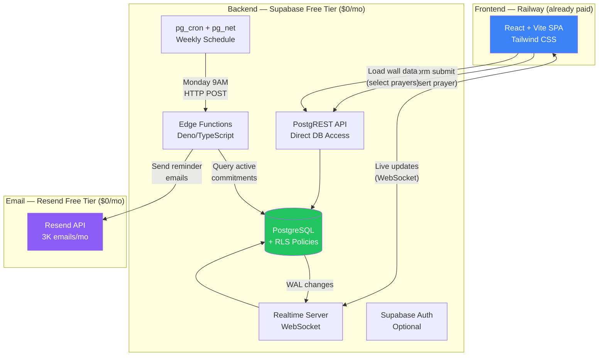

# Prayer Wall architecture

**A React frontend on Railway paired with Supabase's free tier and Resend's free email API delivers everything this app needs — no Python backend, no AWS.** Supabase's pg_cron, Edge Functions, Realtime subscriptions, and Row Level Security handle scheduling, business logic, live updates, and future multi-tenancy natively. This architecture eliminates an entire backend service, reduces operational complexity to near-zero, and has zero additional infrastructure cost since Railway is already paid for. The only paid upgrade path ($25/month for Supabase Pro) becomes relevant only if the app scales to hundreds of active users or needs production guarantees like no project pausing.

## Why a Python backend would be architectural overkill

The central architecture decision — Supabase-native vs. a separate Python backend — resolves clearly in favor of going Supabase-only. Every feature this Prayer Wall requires maps directly to a built-in Supabase capability:

| App requirement | Supabase solution | Python alternative (unnecessary) |
|---|---|---|
| Prayer commitment form submission | PostgREST API direct insert with RLS | FastAPI endpoint → Supabase SDK |
| Prayer wall display | Direct JS client query | FastAPI endpoint → Supabase SDK |
| Weekly reminder emails | pg_cron → Edge Function → Resend | APScheduler/Celery → SMTP |
| Live wall updates | Realtime postgres_changes | WebSocket server or polling |
| Admin category management | PostgREST + RLS admin policies | Admin API endpoints |
| Multi-tenant isolation (future) | RLS with `church_id` column | Middleware tenant filtering |

**Supabase Edge Functions run on Deno's TypeScript runtime** with a **2-second CPU time limit** and **150-second request idle timeout** per invocation. For this app's workload — accepting form data, querying a database, and calling an email API — these limits are generous. The functions support external HTTP calls, environment variable secrets, JWT validation, and CORS handling. The only scenarios justifying a Python backend would be heavy ML processing, complex PDF generation, or Python-only library dependencies — none of which apply here.

Adding a Python API layer would introduce a second deployment pipeline, extra network hops (frontend → Python → Supabase instead of frontend → Supabase), and a maintenance burden disproportionate to the app's simplicity. Since Railway is already in use for frontend hosting, spinning up an additional service there is possible later if needed — but right now **the entire backend layer is already built into Supabase** with zero additional cost.

## Supabase's scheduling and email stack replaces three separate services

The weekly prayer reminder workflow chains three Supabase-native components — **pg_cron**, **pg_net**, and **Edge Functions** — into a single managed pipeline.

**pg_cron** is available on **all Supabase plans including free** as of early 2025. It supports standard crontab syntax, runs jobs from every second to once yearly, and stores run history in `cron.job_run_details` for debugging. Combined with the **pg_net** HTTP extension, it triggers Edge Functions on any schedule. The entire configuration is one SQL statement:

```sql
select cron.schedule(
  'weekly-prayer-reminders',
  '0 13 * * 1',  -- Monday 9 AM Eastern (EDT, UTC-4); use '0 14 * * 1' in winter (EST, UTC-5)
  $$
  select net.http_post(
    url := (select decrypted_secret from vault.decrypted_secrets where name = 'project_url') 
           || '/functions/v1/send-reminders',
    headers := jsonb_build_object(
      'Content-Type', 'application/json',
      'x-cron-secret', (select decrypted_secret from vault.decrypted_secrets where name = 'cron_secret')
    ),
    body := '{}'::jsonb
  ) as request_id;
  $$
);
```

> **Vault setup required:** Before running this SQL, enable Supabase Vault (Project Settings → Vault) and add two secrets: `project_url` (your Supabase project URL) and `cron_secret` (a random secret, e.g. `openssl rand -hex 32`). The `send-reminders` Edge Function must validate this header on every call — `if (req.headers.get('x-cron-secret') !== Deno.env.get('CRON_SECRET')) return new Response('Unauthorized', { status: 401 });` — preventing unauthorized invocations using the publicly known anon key.

This eliminates the need for AWS EventBridge (which requires IAM setup, Lambda functions, and an AWS account) and Railway cron (which requires a running container service at $5/month). **pg_cron costs nothing additional** — it's included with every Supabase project.

For email delivery, **Resend is the definitive choice**. It's Supabase's officially documented email partner with a dedicated integration page, native Edge Function examples, and **3,000 free emails per month** with no expiration or credit card requirement. A church sending weekly reminders to 200 people consumes roughly 800 emails/month — well within the free tier permanently. The Edge Function integration is approximately 15 lines of TypeScript using a simple `fetch()` call to Resend's REST API.

A critical finding: **SendGrid retired its free tier on May 27, 2025**, with full shutdown on July 26, 2025. Many existing guides still reference SendGrid's free plan, but it no longer exists. The cheapest SendGrid plan is now $19.95/month. AWS SES offers 3,000 free emails/month for the first 12 months only, but requires complex IAM configuration, sandbox exit review, and AWS Signature V4 authentication — wildly overengineered for this use case. **Resend wins on every dimension**: cost, integration simplicity, deliverability, and developer experience.

## Realtime and RLS make the wall live and multi-tenant-ready

The prayer wall's signature feature — names appearing as new brick tiles in real time — uses **Supabase Realtime's postgres_changes** channel. When a new prayer commitment is inserted, Supabase's Elixir-based Realtime server detects the change via PostgreSQL's Write-Ahead Log and pushes it to all connected clients over WebSocket. The client code is straightforward:

```typescript
const channel = supabase
  .channel(`prayer-wall-${churchId}`)
  .on('postgres_changes', 
    { event: 'INSERT', schema: 'public', table: 'prayer_commitments', filter: `church_id=eq.${churchId}` },
    (payload) => setPrayers(prev => [...prev, payload.new])
  )
  .subscribe();
```

The channel name and `church_id` filter scope the subscription to a single tenant. Without the filter, every connected client would receive inserts from all churches in multi-tenant mode.

The free tier supports **200 concurrent connections** and **2 million Realtime messages per month**. For a church with ~50 concurrent viewers receiving ~100 new prayer events daily, this translates to roughly 150,000 messages/month — comfortably within limits.

For **multi-tenant readiness**, the critical design decision is adding a `church_id` column from day one, even in single-tenant mode. Row Level Security policies filter all queries by this identifier. The recommended pattern uses JWT custom claims for performance (evaluated once per request, not per row):

```sql
CREATE POLICY "Tenant isolation" ON prayer_commitments FOR ALL TO authenticated
  USING (church_id = (current_setting('request.jwt.claims', true)::json ->> 'church_id'));
```

Two performance-critical RLS best practices: always wrap `auth.uid()` in a subselect — `(select auth.uid())` — so PostgreSQL evaluates it once and caches it rather than re-evaluating per row; and create B-tree indexes on all columns referenced in RLS policies (`CREATE INDEX ix_commitments_church_id ON prayer_commitments USING btree (church_id)`).

## Security considerations

**Email privacy via column-level grants**

The `email` column in `prayer_commitments` must not be readable by the anon role — the prayer wall display only needs `name`. Apply column-level grants after enabling RLS:

```sql
REVOKE SELECT ON prayer_commitments FROM anon;
GRANT SELECT (id, church_id, name, committed_at) ON prayer_commitments TO anon;
```

**Rate limiting and spam prevention**

Direct anon inserts via PostgREST without rate limiting allow bot-driven spam. Route the commitment form through an Edge Function that validates a [Cloudflare Turnstile](https://developers.cloudflare.com/turnstile/) token before inserting. This blocks automated submissions without breaking the zero-cost architecture or requiring a Python backend.

**Email unsubscribe compliance**

CAN-SPAM and GDPR require a working unsubscribe mechanism in every reminder email. The `reminder_active` boolean in `prayer_commitments` supports this. Recommended flow:
1. When sending each email, generate a signed token: `HMAC-SHA256(commitment_id + sent_at, UNSUBSCRIBE_SECRET)`
2. Embed `https://<domain>/unsubscribe?token=<signed-token>` in the email body
3. A dedicated `/unsubscribe` Edge Function validates the token and sets `reminder_active = false`

**Edge Function CORS**

Every Edge Function called from the React frontend must handle `OPTIONS` preflight requests and return `Access-Control-Allow-Origin`. Add this at the top of each function:

```typescript
if (req.method === 'OPTIONS') {
  return new Response(null, {
    headers: {
      'Access-Control-Allow-Origin': 'https://your-app.up.railway.app',
      'Access-Control-Allow-Headers': 'authorization, x-client-info, apikey, content-type, x-cron-secret',
    },
  });
}
```

Replace the `railway.app` origin with your actual Railway service URL (or custom domain if configured).

## Deploy the frontend on Railway

Since Railway is already part of the paid plan, hosting the React SPA there has **zero marginal cost** and keeps the entire project under a single platform account. Railway auto-detects the Node.js project via Nixpacks, runs `npm run build`, and the `serve` package handles SPA routing (returning `index.html` for all client-side routes via the `-s` flag).

The project includes a `railway.json` at the repo root that sets the build and start commands automatically:

```json
{
  "build": { "buildCommand": "npm run build" },
  "deploy": { "startCommand": "npx serve dist -s -l tcp://0.0.0.0:$PORT" }
}
```

Add the three `VITE_*` environment variables in Railway's service dashboard before the first deploy. Railway auto-assigns a public URL (`https://your-service.up.railway.app`) which you'll use as `APP_URL` in the Supabase Edge Function secrets.

**Note:** Railway serves static files from a single-region container rather than a global CDN. For most church apps this is imperceptible. If global edge performance later becomes a priority, Cloudflare Pages or Vercel deploy from the same Git repo with no code changes required.

## The complete architecture in one diagram



**Data flow for a prayer commitment:**
1. User clicks a tile on the commitment page, selects up to 3 prayer categories, enters name + email
2. React frontend calls Supabase PostgREST API to insert into `prayer_commitments` table (RLS validates the insert)
3. Supabase Realtime detects the WAL change and broadcasts to all prayer wall viewers
4. New brick tile animates into the wall with the person's name (no prayer details visible)

**Data flow for weekly reminders:**
1. pg_cron fires at the scheduled time (e.g., Monday 9 AM)
2. pg_net sends an HTTP POST to the `send-reminders` Edge Function
3. Edge Function queries all active commitments for the current week
4. Edge Function calls Resend API to deliver personalized reminder emails
5. Delivery status logged back to a `email_logs` table for monitoring

## Design patterns for the brick/stone prayer wall

While the HCA Fredericksburg /give/ page was not directly accessible for analysis, the described design pattern — a tile/card grid where users interact with individual squares — maps to a well-established UI component. The prayer wall should use **CSS Grid with Tailwind** for the responsive brick layout:

```html
<!-- Prayer Wall Grid -->
<div class="grid grid-cols-3 sm:grid-cols-4 md:grid-cols-6 lg:grid-cols-8 gap-1">
  {prayers.map(prayer => (
    <div class="aspect-square bg-stone-700 text-amber-50 flex items-center 
                justify-center text-xs font-serif p-2 text-center rounded-sm
                shadow-inner border border-stone-600 hover:bg-stone-600 
                transition-colors">
      {prayer.name}
    </div>
  ))}
</div>
```

For the visual aesthetic of inscribed brick/stone tiles, use a **warm earth-tone palette** (stone-700 backgrounds, amber-50 text), **serif typography** (like Lora or Playfair Display) for the engraved name feel, inner shadows for depth, and subtle border variations between tiles to simulate mortar gaps. New tiles should animate in with a `scale-0 → scale-100` transition when they appear via Realtime, giving the wall a living, growing quality.

The commitment page interaction — clicking an available square — can use a similar grid where unselected tiles have a muted appearance and selected tiles glow or change color, with a modal/drawer opening for category selection and name/email entry.

## Recommended database schema for day-one multi-tenant readiness

```sql
-- Core tables
CREATE TABLE churches (
  id UUID PRIMARY KEY DEFAULT gen_random_uuid(),
  name TEXT NOT NULL,
  slug TEXT UNIQUE NOT NULL,
  created_at TIMESTAMPTZ DEFAULT now()
);

CREATE TABLE prayer_categories (
  id UUID PRIMARY KEY DEFAULT gen_random_uuid(),
  church_id UUID REFERENCES churches(id) NOT NULL,
  name TEXT NOT NULL,
  display_order INT DEFAULT 0,
  is_active BOOLEAN DEFAULT true
);

CREATE TABLE prayer_commitments (
  id UUID PRIMARY KEY DEFAULT gen_random_uuid(),
  church_id UUID REFERENCES churches(id) NOT NULL,
  name TEXT NOT NULL,
  email TEXT NOT NULL,  -- restricted to authenticated/admin roles; see Security Considerations
  committed_at TIMESTAMPTZ DEFAULT now(),
  reminder_active BOOLEAN DEFAULT true,
  last_reminded_at TIMESTAMPTZ
);

CREATE TABLE prayer_commitment_categories (
  commitment_id UUID REFERENCES prayer_commitments(id) ON DELETE CASCADE NOT NULL,
  category_id UUID REFERENCES prayer_categories(id) ON DELETE CASCADE NOT NULL,
  PRIMARY KEY (commitment_id, category_id)
);
-- Enforce max 3 categories per commitment in the Edge Function / application layer

CREATE TABLE email_logs (
  id UUID PRIMARY KEY DEFAULT gen_random_uuid(),
  church_id UUID REFERENCES churches(id) NOT NULL,
  commitment_id UUID REFERENCES prayer_commitments(id),
  email TEXT NOT NULL,
  status TEXT NOT NULL CHECK (status IN ('sent', 'failed', 'bounced')),
  sent_at TIMESTAMPTZ DEFAULT now(),
  resend_message_id TEXT
);

-- Indexes for RLS performance
CREATE INDEX ix_commitments_church ON prayer_commitments(church_id);
CREATE INDEX ix_categories_church ON prayer_categories(church_id);
CREATE INDEX ix_commitment_categories_commitment ON prayer_commitment_categories(commitment_id);
CREATE INDEX ix_commitment_categories_category ON prayer_commitment_categories(category_id);
CREATE INDEX ix_email_logs_church ON email_logs(church_id);

-- Enable Realtime on the wall table
ALTER PUBLICATION supabase_realtime ADD TABLE prayer_commitments;
```

## Additional cost for this project: $0/month

| Component | Solution | Additional monthly cost |
|---|---|---|
| Frontend hosting | Railway (already paid) | **$0** |
| Database + API | Supabase Free Tier | **$0** |
| Backend logic | Supabase Edge Functions | **$0** |
| Email delivery | Resend Free (3,000/mo) | **$0** |
| Scheduling | Supabase pg_cron | **$0** |
| **Total additional cost** | | **$0/month** |

The free tier limits are generous for a church app: **500 MB database**, **50,000 monthly active users**, **500,000 Edge Function invocations**, **2 million Realtime messages**, **200 concurrent connections**, and **3,000 emails/month**. The only real constraint is that **Supabase pauses free-tier projects after 7 days of inactivity** — but the weekly pg_cron job itself should prevent pausing. If this becomes an issue, upgrading to Supabase Pro at $25/month eliminates it.

## Conclusion

The architecture is radically simple: **React + Tailwind on Railway, Supabase for everything backend, Resend for email.** No Python. No AWS. Since Railway is already part of the paid plan, there is no additional infrastructure cost. The `church_id` column baked into every table from day one means multi-tenancy requires only new RLS policies and a tenant selector — no schema migration. Supabase's pg_cron + Edge Functions + Realtime combination replaces what would traditionally require a backend server, a task queue, a WebSocket server, and a cron daemon. For a church developer building their first production app, this stack minimizes both cost and cognitive overhead while leaving room to grow.

---

## Changelog

| Date | Change |
|---|---|
| 2026-03-25 | Fixed DST offset bug in pg_cron schedule (`0 14` → `0 13` for EDT); added winter/summer note |
| 2026-03-25 | Replaced `anon_key` authorization in pg_cron trigger with `cron_secret` custom header; added Vault setup requirement |
| 2026-03-25 | Added tenant-scoped channel name and `church_id=eq.${churchId}` filter to Realtime subscription |
| 2026-03-25 | Standardized table name from `prayers` to `prayer_commitments` in RLS policy, Realtime subscription, and index example |
| 2026-03-25 | Replaced `categories UUID[]` denormalized column with `prayer_commitment_categories` junction table |
| 2026-03-25 | Added `email_logs` table to schema (referenced in email data flow but previously absent) |
| 2026-03-25 | Added Security Considerations section: email column-level grants, rate limiting/spam prevention, unsubscribe compliance, Edge Function CORS |
| 2026-03-26 | Replaced Cloudflare Pages with Railway as frontend host; updated title, intro, hosting section, diagram, cost table, conclusion, and CORS example to reflect existing Railway subscription |